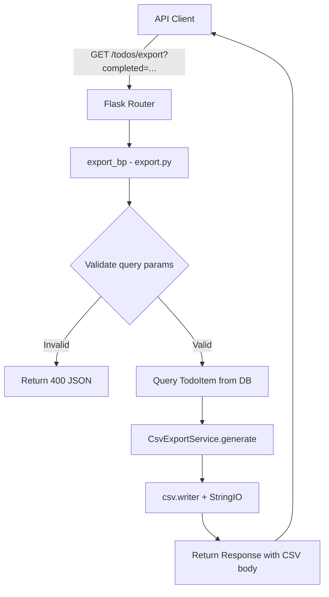

# Design Document: Export Todos as CSV

## Overview

This feature adds a CSV export endpoint to the existing Flask todo API. It allows API clients to download all (or filtered) todo items as a properly formatted CSV file conforming to RFC 4180. The implementation uses Python's built-in `csv` module and `io.StringIO` for in-memory CSV generation, returning the result as a streaming response with appropriate headers.

Key design decisions:
- **Use Python's `csv` module** — it handles RFC 4180 quoting, escaping, and CRLF line endings natively, avoiding custom formatting logic.
- **In-memory generation via `io.StringIO`** — suitable for the expected data volume (todo lists are typically small); avoids temporary files.
- **New blueprint** — the export endpoint lives in a dedicated `export.py` route module to maintain separation of concerns from the CRUD routes.
- **Filtering via query parameter** — the optional `completed` query parameter enables filtered exports without requiring a separate endpoint.

## Architecture



The request flows through:
1. **Flask Router** dispatches to the export blueprint
2. **Query parameter validation** checks the optional `completed` filter
3. **Database query** fetches TodoItems with optional filter, ordered by `created_at` ascending
4. **CsvExportService** formats the data as RFC 4180-compliant CSV
5. **Flask Response** is returned with `text/csv` content type and attachment disposition

## Components and Interfaces

### 1. Export Route (`app/src/routes/export.py`)

A new Flask Blueprint registered at `/todos/export`.

```python
# Blueprint: export_bp, url_prefix="/todos"
# Route: GET /export

def export_todos():
    """Handle GET /todos/export with optional ?completed=true|false filter."""
    ...
```

**Responsibilities:**
- Parse and validate the `completed` query parameter
- Query the database for matching TodoItems
- Delegate CSV generation to `CsvExportService`
- Construct and return the HTTP response with correct headers
- Handle errors (invalid params → 400, DB errors → 500)

### 2. CSV Export Service (`app/src/services/csv_export.py`)

A pure-function service module responsible for converting a list of TodoItem instances into a CSV string.

```python
class CsvExportService:
    COLUMNS = ["id", "title", "description", "completed", "created_at"]

    @staticmethod
    def generate(items: list[TodoItem]) -> str:
        """Convert a list of TodoItem objects to an RFC 4180 CSV string."""
        ...
```

**Responsibilities:**
- Write the header row
- Format each TodoItem field according to requirements:
  - `id`: integer as string
  - `title`: string (csv module handles quoting)
  - `description`: empty string for None, otherwise the text
  - `completed`: lowercase "true" or "false"
  - `created_at`: ISO 8601 format with "Z" suffix
- Use `csv.writer` with `quoting=csv.QUOTE_MINIMAL` for RFC 4180 compliance
- Use CRLF line endings (default for `csv.writer`)
- Return UTF-8 encoded string without BOM

### 3. Registration in App Factory (`app/src/__init__.py`)

The export blueprint is registered alongside existing blueprints:

```python
from app.src.routes.export import export_bp
app.register_blueprint(export_bp)
```

## Data Models

No new database models are required. The feature reads from the existing `TodoItem` model:

```python
class TodoItem(db.Model):
    __tablename__ = "todos"

    id: Mapped[int]           # Primary key, autoincrement
    title: Mapped[str]        # String(200), not null
    description: Mapped[str | None]  # Text, nullable
    completed: Mapped[bool]   # Boolean, default False
    created_at: Mapped[datetime]     # DateTime(timezone=True), default utcnow
```

### CSV Row Mapping

| DB Field     | CSV Column   | Formatting Rule                                    |
|-------------|-------------|---------------------------------------------------|
| `id`        | id          | Integer as string                                  |
| `title`     | title       | String, quoted if contains comma/quote/newline     |
| `description` | description | Empty string if None, otherwise string value     |
| `completed` | completed   | Lowercase "true" or "false"                        |
| `created_at` | created_at | ISO 8601 with "Z" suffix (e.g., "2024-01-15T10:30:00Z") |

### Response Headers

| Header             | Value                              |
|-------------------|------------------------------------|
| Content-Type      | `text/csv; charset=utf-8`          |
| Content-Disposition | `attachment; filename=todos.csv` |


## Correctness Properties

*A property is a characteristic or behavior that should hold true across all valid executions of a system — essentially, a formal statement about what the system should do. Properties serve as the bridge between human-readable specifications and machine-verifiable correctness guarantees.*

### Property 1: CSV round-trip integrity

*For any* list of TodoItems (with arbitrary titles, descriptions including None, completed states, and created_at timestamps), exporting to CSV and then parsing the CSV with Python's `csv.reader` SHALL produce rows where: the `id` field parses to the original integer, the `title` field matches the original string exactly, the `description` field is empty string for None or matches the original text, the `completed` field is "true" or "false" matching the original boolean, and the `created_at` field parses as a valid ISO 8601 UTC timestamp matching the original datetime.

**Validates: Requirements 3.1, 1.1, 1.3, 2.4, 2.5, 2.6**

### Property 2: RFC 4180 special character quoting

*For any* TodoItem whose title or description contains commas, double quotes, or newline characters (LF, CR, or CRLF), the CSV output SHALL enclose that field in double quotes, and any embedded double quote characters SHALL be escaped by doubling them, such that a compliant CSV parser recovers the original value.

**Validates: Requirements 1.6, 2.1, 2.2, 2.3**

### Property 3: Completion filter correctness

*For any* set of TodoItems with mixed completion states, exporting with `?completed=true` SHALL return only items where completed is true, exporting with `?completed=false` SHALL return only items where completed is false, and in both cases results SHALL be ordered by created_at ascending.

**Validates: Requirements 5.1, 5.2, 5.3, 5.5**

### Property 4: Invalid filter parameter rejection

*For any* string value that is not exactly "true" or "false" (including "True", "FALSE", "1", "0", empty string, or arbitrary text), providing it as the `completed` query parameter SHALL result in an HTTP 400 response with a JSON body containing a "message" field.

**Validates: Requirements 5.4**

## Error Handling

| Scenario | HTTP Status | Content-Type | Response Body |
|----------|-------------|--------------|---------------|
| Invalid `completed` query param | 400 | application/json | `{"message": "completed parameter must be 'true' or 'false'"}` |
| Database unavailable | 500 | application/json | `{"message": "Unable to reach data source"}` |
| Unexpected error during CSV generation | 500 | application/json | `{"message": "An error occurred during export"}` |

**Error handling strategy:**
- The route handler wraps the entire export logic in a try/except block
- `SQLAlchemyError` is caught specifically to detect database connectivity issues
- A general `Exception` catch ensures no partial CSV is ever returned
- All error responses are JSON with a `message` field, never partial CSV content
- Errors are logged with `logger.exception()` for debugging

## Testing Strategy

### Property-Based Tests (Hypothesis)

The project already uses Hypothesis for property-based testing. Each correctness property maps to one or more property-based tests with a minimum of 100 iterations.

**Library:** Hypothesis (already in dev dependencies)
**Configuration:** `@settings(max_examples=100)`
**Tag format:** `# Feature: export-todos-csv, Property {N}: {title}`

| Property | Test Description | Key Generators |
|----------|-----------------|----------------|
| Property 1 | Generate random TodoItems, export via endpoint, parse CSV, verify field equality | `st.text` for titles/descriptions, `st.booleans` for completed, `st.datetimes` for created_at |
| Property 2 | Generate strings with special chars (commas, quotes, newlines), create TodoItems, export, verify raw CSV quoting | `st.text(alphabet=st.characters(whitelist_categories=('L','N','P','Z','Cc')))` |
| Property 3 | Generate mixed completed/incomplete items, export with filter, verify only matching items returned in order | `st.lists(st.booleans())` for completed states |
| Property 4 | Generate arbitrary strings excluding "true"/"false", call endpoint, verify 400 | `st.text().filter(lambda s: s not in ("true", "false"))` |

### Unit Tests (pytest)

Unit tests cover specific examples and edge cases:

- Empty collection returns header-only CSV with CRLF line ending
- Response headers (Content-Type, Content-Disposition) are correct
- UTF-8 encoding without BOM
- CRLF line endings throughout the file
- Specific formatting examples (known input → known output)

### Integration Tests

Integration tests cover error scenarios requiring mocks:

- Database unavailable → 500 with JSON error
- Unexpected exception during generation → 500 with JSON error, no partial CSV
