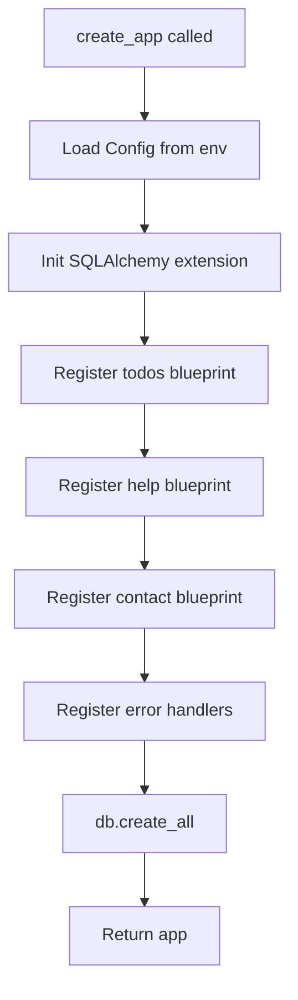

# Design Document: Todo App

## Overview

The Todo App is a RESTful web service built with Flask that provides CRUD operations for todo items. It follows the application factory pattern, persists data via Flask-SQLAlchemy, and validates all incoming request payloads with Pydantic before they reach the database layer.

The application exposes a JSON API at five endpoints (`POST /todos`, `GET /todos`, `GET /todos/<id>`, `PUT /todos/<id>`, `DELETE /todos/<id>`) plus a human-readable HTML help page at `GET /help` and a static HTML contact page at `GET /contact`. It runs locally on `127.0.0.1:5001` and is deployed to production via gunicorn. All configuration is supplied through environment variables.

### Key Design Goals

- **Separation of concerns**: routes handle HTTP, models handle persistence, schemas handle validation — each layer has a single responsibility.
- **Fail-fast validation**: Pydantic schemas reject invalid payloads before any database interaction occurs.
- **Predictable error responses**: every error returns a JSON body with a `message` field and a consistent HTTP status code.
- **Twelve-factor configuration**: all environment-specific values (database URL, secret key) are injected via environment variables.

---

## Architecture

The application follows a layered architecture within the Flask application factory pattern:

```
┌─────────────────────────────────────────────────────┐
│                    HTTP Client                       │
└──────────────────────┬──────────────────────────────┘
                       │ HTTP Request
┌──────────────────────▼──────────────────────────────┐
│               Flask Route Layer                      │
│         app/src/routes/todos.py                      │
│         app/src/routes/help.py                       │
│         app/src/routes/contact.py                    │
│  - Parse request JSON                                │
│  - Delegate to Pydantic schema for validation        │
│  - Call model/db layer                               │
│  - Serialize response                                │
└──────────────────────┬──────────────────────────────┘
                       │
┌──────────────────────▼──────────────────────────────┐
│            Pydantic Validation Layer                 │
│         app/src/schemas/todo_schemas.py              │
│  - TodoCreateSchema                                  │
│  - TodoUpdateSchema                                  │
│  - TodoResponseSchema                                │
└──────────────────────┬──────────────────────────────┘
                       │
┌──────────────────────▼──────────────────────────────┐
│           SQLAlchemy Model Layer                     │
│         app/src/models/todo.py                       │
│  - TodoItem ORM model                                │
│  - CRUD helper methods                               │
└──────────────────────┬──────────────────────────────┘
                       │
┌──────────────────────▼──────────────────────────────┐
│              Database (SQLite / PostgreSQL)           │
│         Configured via DATABASE_URL env var          │
└─────────────────────────────────────────────────────┘
```

### Application Factory

The `create_app()` factory in `app/src/__init__.py` wires everything together:

1. Load configuration from environment variables.
2. Initialise Flask extensions (SQLAlchemy) via `app/src/extensions.py`.
3. Register blueprints (`todos_bp`, `help_bp`, `contact_bp`).
4. Register global error handlers.
5. Create database tables if they do not exist.



---

## Components and Interfaces

### 1. Application Factory — `app/src/__init__.py`

```python
def create_app(config_object: str | None = None) -> Flask
```

- Reads `SECRET_KEY` (required) and `DATABASE_URL` (optional, defaults to `sqlite:///todos.db`) from the environment.
- Raises `RuntimeError` and logs an error if `SECRET_KEY` is absent.
- Calls `db.init_app(app)` from `extensions.py`.
- Registers blueprints and error handlers (`todos_bp`, `help_bp`, `contact_bp`).

### 2. Extensions — `app/src/extensions.py`

```python
db: SQLAlchemy  # single shared instance, initialised lazily
```

Holds the single `SQLAlchemy` instance that is imported by models and the factory.

### 3. Configuration — `app/src/config.py`

| Class | Purpose |
|---|---|
| `BaseConfig` | Shared defaults (`SQLALCHEMY_TRACK_MODIFICATIONS = False`) |
| `DevelopmentConfig(BaseConfig)` | `DEBUG = True`, binds to `127.0.0.1:5001` |
| `ProductionConfig(BaseConfig)` | `DEBUG = False`, gunicorn entry point |

All sensitive values are read from `os.environ` inside the factory, not hardcoded in config classes.

### 4. Todo Model — `app/src/models/todo.py`

ORM model backed by a `todos` table. Exposes a `to_dict()` helper for JSON serialisation.

### 5. Pydantic Schemas — `app/src/schemas/todo_schemas.py`

| Schema | Used by | Purpose |
|---|---|---|
| `TodoCreateSchema` | `POST /todos` | Validates `title` (required, 1–200 non-whitespace chars) and optional `description` (1–1000 chars) |
| `TodoUpdateSchema` | `PUT /todos/<id>` | Validates optional `title`, optional `description`, optional `completed` (bool) |
| `TodoResponseSchema` | All responses | Serialises a `TodoItem` to the canonical JSON shape |

Validation errors from Pydantic are caught in the route layer and converted to `{"message": "..."}` with HTTP 422.

### 6. Todos Blueprint — `app/src/routes/todos.py`

Registered at prefix `/todos`. Implements all five CRUD endpoints.

| Method | Path | Handler |
|---|---|---|
| `POST` | `/todos` | `create_todo` |
| `GET` | `/todos` | `list_todos` |
| `GET` | `/todos/<int:id>` | `get_todo` |
| `PUT` | `/todos/<int:id>` | `update_todo` |
| `DELETE` | `/todos/<int:id>` | `delete_todo` |

### 7. Help Blueprint — `app/src/routes/help.py`

Registered at prefix `/help`. Renders `app/src/templates/help.html` with HTTP 200.

### 8. Contact Blueprint — `app/src/routes/contact.py`

Registered at prefix `/contact`. Renders `app/src/templates/contact.html` with HTTP 200 and a `Content-Type` of `text/html; charset=utf-8`.

The template displays at least one contact method: either a `mailto:` link or an HTML form containing name, email, and message fields. No dynamic data is required — the route handler is a single `render_template` call.

| Method | Path | Handler |
|---|---|---|
| `GET` | `/contact` | `contact_page` |

The blueprint is registered in `create_app()` alongside `todos_bp` and `help_bp`.

**Template**: `app/src/templates/contact.html`

Provides a static Contact Us page. Must include at least one of:
- A `<a href="mailto:...">` link, **or**
- An HTML `<form>` with `<input>` (or `<textarea>`) fields for name, email, and message.

### 9. Error Handlers

Registered globally in the factory:

| Trigger | HTTP Status | Response |
|---|---|---|
| `404 Not Found` | 404 | `{"message": "Not found"}` |
| `400 Bad Request` | 400 | `{"message": "Bad request"}` |
| `422 Unprocessable Entity` | 422 | `{"message": "<field>: <reason>"}` |
| `500 Internal Server Error` | 500 | `{"message": "Internal server error"}` |

---

## Data Models

### Database Table: `todos`

| Column | Type | Constraints | Notes |
|---|---|---|---|
| `id` | `INTEGER` | `PRIMARY KEY AUTOINCREMENT` | Surrogate key |
| `title` | `VARCHAR(200)` | `NOT NULL` | 1–200 non-whitespace characters |
| `description` | `TEXT` | `NULLABLE` | 1–1000 characters when present |
| `completed` | `BOOLEAN` | `NOT NULL`, default `false` | Task completion flag |
| `created_at` | `DATETIME` | `NOT NULL`, default `utcnow` | Set once at creation; never updated |

### SQLAlchemy ORM Model

```python
class TodoItem(db.Model):
    __tablename__ = "todos"

    id: Mapped[int] = mapped_column(Integer, primary_key=True, autoincrement=True)
    title: Mapped[str] = mapped_column(String(200), nullable=False)
    description: Mapped[str | None] = mapped_column(Text, nullable=True)
    completed: Mapped[bool] = mapped_column(Boolean, nullable=False, default=False)
    created_at: Mapped[datetime] = mapped_column(
        DateTime, nullable=False, default=datetime.utcnow
    )

    def to_dict(self) -> dict:
        return {
            "id": self.id,
            "title": self.title,
            "description": self.description,
            "completed": self.completed,
            "created_at": self.created_at.isoformat() + "Z",
        }
```

### Pydantic Schemas

```python
class TodoCreateSchema(BaseModel):
    title: str = Field(..., min_length=1, max_length=200)
    description: str | None = Field(None, min_length=1, max_length=1000)

    @field_validator("title")
    @classmethod
    def title_not_whitespace(cls, v: str) -> str:
        if not v.strip():
            raise ValueError("title must not be blank")
        return v.strip()


class TodoUpdateSchema(BaseModel):
    title: str | None = Field(None, min_length=1, max_length=200)
    description: str | None = Field(None, min_length=1, max_length=1000)
    completed: bool | None = None

    @field_validator("title")
    @classmethod
    def title_not_whitespace(cls, v: str | None) -> str | None:
        if v is not None and not v.strip():
            raise ValueError("title must not be blank")
        return v.strip() if v else v
```

### JSON Response Shape

All successful responses return a `TodoItem` serialised as:

```json
{
  "id": 1,
  "title": "Buy milk",
  "description": null,
  "completed": false,
  "created_at": "2024-01-15T10:30:00Z"
}
```

List responses wrap items in a JSON array:

```json
[
  { "id": 1, "title": "Buy milk", ... },
  { "id": 2, "title": "Walk dog", ... }
]
```

Error responses always use:

```json
{ "message": "<human-readable reason>" }
```

---

## Correctness Properties

*A property is a characteristic or behavior that should hold true across all valid executions of a system — essentially, a formal statement about what the system should do. Properties serve as the bridge between human-readable specifications and machine-verifiable correctness guarantees.*

### Property 1: Creation round-trip preserves all fields

*For any* valid todo creation payload (non-empty, non-whitespace title of 1–200 characters, with or without a description), creating a todo item via `POST /todos` and then retrieving it via `GET /todos/<id>` SHALL return a todo item whose `id`, `title`, `description`, `completed`, and `created_at` fields all match the creation response.

**Validates: Requirements 1.1, 1.6, 2.3, 3.1**

### Property 2: Whitespace-only titles are always rejected

*For any* string composed entirely of whitespace characters (spaces, tabs, newlines), submitting it as the `title` in either a `POST /todos` or a `PUT /todos/<id>` request SHALL be rejected with HTTP 422 and a JSON body containing a `message` field, leaving the todo list unchanged.

**Validates: Requirements 1.2, 4.3, 7.2, 7.3**

### Property 3: Titles exceeding 200 characters are always rejected

*For any* string whose character length exceeds 200, submitting it as the `title` in either a `POST /todos` or a `PUT /todos/<id>` request SHALL be rejected with HTTP 422.

**Validates: Requirements 1.3, 4.4, 7.4**

### Property 4: Missing required field always returns 422 with a message

*For any* `POST /todos` request body that omits the `title` field entirely, the response SHALL be HTTP 422 with a JSON body containing a `message` field that identifies the missing field.

**Validates: Requirements 1.4, 7.5**

### Property 5: Newly created items have correct default values

*For any* valid todo creation payload, the created item SHALL have `completed` set to `false` and a `created_at` value that is a valid ISO 8601 UTC timestamp.

**Validates: Requirements 1.5**

### Property 6: List is always ordered by creation time ascending

*For any* sequence of N todo items (N ≥ 1) created in succession, `GET /todos` SHALL return them in ascending `created_at` order.

**Validates: Requirements 2.1**

### Property 7: Update round-trip reflects all changed fields

*For any* existing todo item and any valid update payload (optional `title`, optional `description`, optional boolean `completed`), sending `PUT /todos/<id>` with that payload SHALL result in `GET /todos/<id>` returning an item whose updated fields match the submitted values.

**Validates: Requirements 4.1, 4.5**

### Property 8: Delete removes item from all access paths

*For any* existing todo item, after a successful `DELETE /todos/<id>` (HTTP 204), a subsequent `GET /todos` SHALL not contain an item with that `id`, and a subsequent `GET /todos/<id>` SHALL return HTTP 404.

**Validates: Requirements 5.1, 3.2**

### Property 9: Non-existent ID always returns 404 with a message field

*For any* positive integer ID that does not correspond to an existing todo item, both `GET /todos/<id>` and `DELETE /todos/<id>` SHALL return HTTP 404 with a JSON body containing a `message` field.

**Validates: Requirements 3.2, 5.2**

---

## Error Handling

### Validation Errors (HTTP 422)

Pydantic `ValidationError` exceptions are caught in each route handler (or a shared decorator). The first validation error message is extracted and returned as:

```json
{ "message": "title: field required" }
```

### Not Found (HTTP 404)

When `db.session.get(TodoItem, id)` returns `None`, the route returns:

```json
{ "message": "Todo item not found" }
```

### Bad Request (HTTP 400)

When `request.get_json(silent=True)` returns `None` (malformed or missing JSON body on PUT), the route returns:

```json
{ "message": "Request body must be valid JSON" }
```

### Invalid Path Parameter (HTTP 422 / 400)

Flask's `<int:id>` converter rejects non-integer path segments automatically. For `GET /todos/<id>` and `PUT /todos/<id>` this returns HTTP 404 by default from Flask; the global 404 handler converts it to the standard error shape. For `DELETE /todos/<id>` the requirement specifies HTTP 400 for non-integer IDs — a string converter with manual validation is used for that route.

### Database Errors (HTTP 500)

`SQLAlchemyError` exceptions bubble up to the global 500 handler, which logs the exception and returns:

```json
{ "message": "Internal server error" }
```

### Startup Errors

If `SECRET_KEY` is not set, `create_app()` raises `RuntimeError("SECRET_KEY environment variable is required")` before the app starts, preventing the server from binding.

---

## Testing Strategy

### Approach

The test suite uses **pytest** with **pytest-flask** for the Flask test client and **Hypothesis** for property-based testing. The database under test is an in-memory SQLite instance created fresh for each test session (or each test function for isolation).

### Unit Tests (`tests/unit/`)

Focus on the Pydantic schema layer in isolation — no Flask app or database required:

- `TodoCreateSchema` accepts valid titles (1–200 non-whitespace chars).
- `TodoCreateSchema` rejects empty strings, whitespace-only strings, and strings > 200 chars.
- `TodoUpdateSchema` accepts partial updates (only `completed`, only `title`, etc.).
- `TodoUpdateSchema` rejects non-boolean `completed` values.
- `TodoItem.to_dict()` serialises all fields correctly, including ISO 8601 UTC timestamp format.

### Integration Tests (`tests/integration/`)

Use the Flask test client against an in-memory SQLite database:

- `POST /todos` with valid body → 201 + correct JSON shape.
- `POST /todos` with missing `title` → 422.
- `GET /todos` on empty database → 200 + `[]`.
- `GET /todos` returns items ordered by `created_at` ascending.
- `GET /todos/<id>` for existing item → 200 + correct item.
- `GET /todos/<id>` for missing item → 404 + `message` field.
- `PUT /todos/<id>` updates fields and returns updated item.
- `PUT /todos/<id>` with non-JSON body → 400.
- `DELETE /todos/<id>` removes item → 204.
- `DELETE /todos/<id>` for missing item → 404.
- `GET /help` → 200 + HTML content.
- `GET /contact` → 200 + `Content-Type` begins with `text/html` + body contains a contact method (mailto link or form with name/email/message fields).
- Missing `SECRET_KEY` at startup → `RuntimeError`.

### Property-Based Tests (`tests/property/`)

Uses **Hypothesis** with a minimum of 100 examples per property. Each test is tagged with a comment referencing the design property.

**Library**: [Hypothesis](https://hypothesis.readthedocs.io/) (`uv add hypothesis`)

**Configuration**: `settings(max_examples=100)` applied to each `@given` test.

| Test | Design Property | Strategy |
|---|---|---|
| `test_creation_round_trip` | Property 1 | `st.text(min_size=1, max_size=200).filter(str.strip)` for title; optional `st.text(min_size=1, max_size=1000)` for description |
| `test_whitespace_title_rejected` | Property 2 | `st.text(alphabet=" \t\n\r")` for title on both POST and PUT |
| `test_title_too_long_rejected` | Property 3 | `st.text(min_size=201)` for title on both POST and PUT |
| `test_missing_title_returns_422` | Property 4 | `st.fixed_dictionaries({})` or random dicts without `title` key |
| `test_creation_defaults` | Property 5 | Random valid todo payloads; assert `completed=false` and valid ISO 8601 `created_at` |
| `test_list_ordering` | Property 6 | `st.integers(min_value=1, max_value=10)` for N; create N todos, verify sorted order |
| `test_update_round_trip` | Property 7 | `st.booleans()` for completed; `st.text(min_size=1, max_size=200).filter(str.strip)` for title |
| `test_delete_removes_item` | Property 8 | Random valid todo, create then delete, verify 204 + 404 on GET |
| `test_nonexistent_id_returns_404` | Property 9 | `st.integers(min_value=1)` as IDs against empty DB; verify 404 + message field |

**Tag format**: Each property test includes a comment:
```python
# Feature: todo-app, Property N: <property text>
```

### Test Execution

```bash
# Run all tests
uv run pytest

# Run only property tests
uv run pytest tests/property/

# Run with verbose output
uv run pytest -v
```
